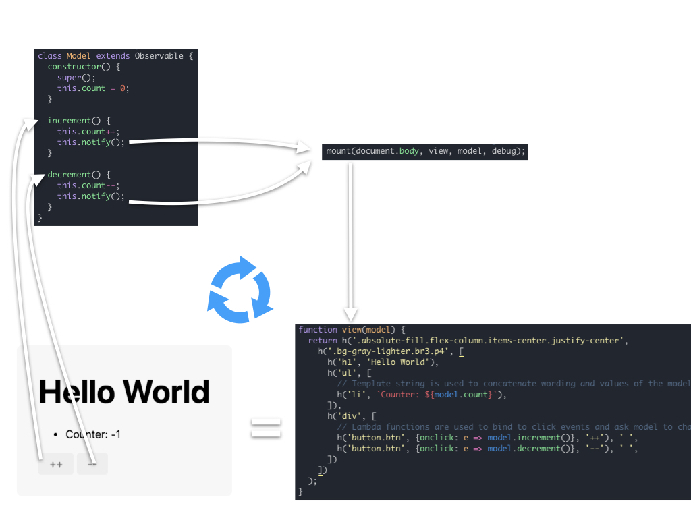

# Frontend - Hyperscript and vnode

Web page view is described by the browser's DOM tree and can be manipulated using [DOM API](https://developer.mozilla.org/en-US/docs/Web/API/Document_Object_Model). It can also be represented using HTML in a static and declarative way. Hyperscript is a similar representation but it is dynamic and uses Javascript function to represent a DOM element with its attributes and children.
Here are the two equivalent representations, HTML and Hyperscript respectively:

```html
<h1 class="title">Hello</h1>
```

```js
h('h1', {class: 'title'}, 'Hello')
```

The Hyperscript function produces a virtual-node (vnode). As it is written in JavaScript it supports variables, conditions, etc. just like any other JavaScript program. A vnode is an abstract object representing a DOM element. It can be directly translated into DOM element using a render engine.

Typically, vnodes are then recreated every render cycle, which normally occurs in response to event handlers (clicks) or to data changes (Ajax response). The template enfine diffs a vnode tree against its previous version and only modifies DOM elements in spots where there are changes.

It may seem wasteful to recreate vnodes so frequently, but as it turns out, modern Javascript engines can create hundreds of thousands of objects in less than a millisecond. On the other hand, modifying the whole DOM is more expensive than creating vnodes.

In the end rendering a web page is simple as:

```js
let virtualNode = h('h1', {class: 'title'}, 'World');
render(document.body, virtualNode);

// equivalent HTML:
// <h1 class="title">Hello</h1>
```

Note: As vnodes can be modified by the template engine you must not reuse them. Instead, create a new instance for each view redraw.

## Render vnodes

The template engine needs only one vnode tree to draw DOM tree, two functions do that:
- `render` render a vnode tree inside a DOM element
- `mount` same but also listen to an `Observable` model and re-render when changed

```js
import {h, mount, Observable} from '/js/src/index.js';
const model = new Observable();
const view = (model) => h('h1.title', `hello ${model.name}`);
mount(document.body, view, model);
model.name = 'Alice';
model.notify();
```

This example will show a simple title, [here is the result as a demo](http://jsfiddle.net/vkosmala/dskb92co/).

You will notice we use an `Observable` model. When we `notify` a change, `mount` will update the view according to the new state.
Usually, we don't call directly `model.notify()` by hand but with a call coming from the view (a click, an input).
We can listen to those events by attaching an handler (anonymous function) to an element: `onclick: () => action()`.

```js
import {h, mount, Observable} from '/js/src/index.js';
class Model extends Observable {
  constructor() {
    super();
    this.count = 0;
  }

  increment() {
    this.count++;
    this.notify();
  }
}
const view = (model) => h('button', {onclick: () => model.increment()}, `${this.count} ++`);
mount(document.body, view, model);
```

The result is a counter we can increment.
[Here is a demo](http://jsfiddle.net/vkosmala/0ouLtv7r/) of this concept, with CSS and a decrement function in addition to the code above.

The template engine flow can be seen as a cycle:


See [Components](components.md) guide to learn more about re-usability and maintenance.
See [API Reference for JS](../reference/frontend-api.md#module_renderer..h) for function prototypes.
See [skeleton](../skeleton/) for function project bootstrap.

## Tools

### switchCase

Because hyperscript can be written in functional programming, a functional switchCase is provided. Javascript comes with a native `switch case` statement not compatible with functional programming.

```js
import {h, switchCase} from '/js/src/index.js';

default export (model) => h('div', [
  h('h1', 'Hello'),
  switchCase(model.page, {
    list: () => h('p', 'print list'),
    item: () => h('p', 'print item'),
    form: () => h('p', 'print form'),
  }, h('p', 'print default'))();
]);
```

### icons

Icons with SVG are not easy to read and take space in the source code, Framework provides them ready to use. The full list is inside `icons.js` and documented in the [CSS Reference](https://aliceo2group.github.io/WebUi/Framework/docs/reference/frontend-css.html#icons) page so you can see them and choose which one to pick. Simply put the mouse cursor on top of it to get the function name.

```js
import {h, iconAccountLogin} from '/js/src/index.js';

default export (model) => h('div', [
  h('h1', 'Hello'),
  iconAccountLogin()
]);
```

## Keys in hyperscript

When manipulating a list of items with Hyperscript, the `key` attribute helps the engine to identify the element. This key should be constant and unique like DB primary key. Do not use array indexes as they may chage (eg. when you sort the array).
```js
const videoGallery = (videos) => videos.map((video) => {
  return h('video', {src: video.src, key: video.src});
});

```

### JSX disclaimer

This concept is used by many recent libraries and frameworks like AngularJS, ReactJS, MithrilJS, Hyperapp. ou In addition to Hyperscript they usually allow to use JSX, which is a new syntax producing vnodes without using `h()`. We dropped the idea of using JSX as it introduces additional dependency on BabelJS.
