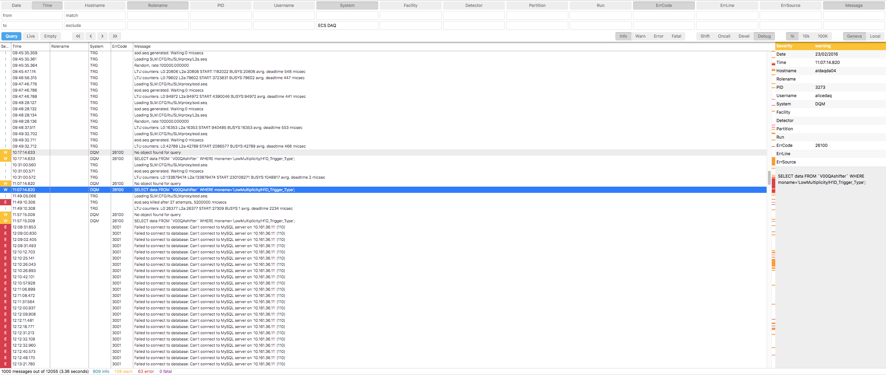

# InfoLogger GUI (ILG)

Web user interface of [InfoLogger](https://github.com/AliceO2Group/InfoLogger) logging system with protocol 1.3 and 1.4 . It supports:
- Querying historical logs from a database
- Receiving Real-Time logs from an TCP endpoint over [InfoLogger protocol](https://github.com/AliceO2Group/InfoLogger/blob/master/src/infoLoggerMessage.c)

## Requirements
- `nodejs` >= 8.9.4
- InfoLogger MySQL database (required for Query mode)
- InfoLoggerServer endpoint (required for Live mode)

## Installation
1. `git clone https://github.com/AliceO2Group/WebUi.git`
1. `cd WebUI/InfoLogger; npm install`
1. `cp config-default.js config.js`
1. Modify `config.js` file to set InfoLogger database and endpoint details
1. Start web app: `npm start`
1. Navigate your browser to the configured URL

## Dummy InfoLogger test server
InfoLoggerServer can be simulated by running `npm run simul`. The dummy server binds `localhost:6102` endpoint.

## Interface user guide
- Use top panel to set filters if needed (match and exclude)
- Click "Query" or "Live" button to start the selected mode
- Click on log records to see more details in the inspector (right panel)
- Show/hide columns by clicking on labels on top of page
- Use arrows keys to navigate quickly between logs

## InfoLogger insights
- [Message protocol](docs/stream-specs.txt)
- [Database structure](docs/database-specs.sql)
